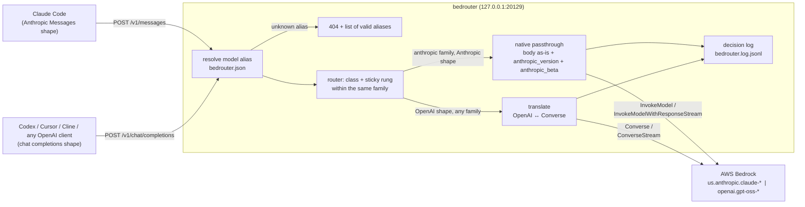

# Bedrouter

A thin local proxy that lets AI coding CLIs (Claude Code, Codex, Cursor, Cline, ...) talk to **AWS Bedrock** through the API shapes they already speak. One endpoint on localhost, Bedrock as the only backend, a static model map with a cost table, and a JSON-lines decision log for every request.

In front of the model map sits a class-based router that sends each request to the cheapest model in its family that should complete the task reliably, sticks to that choice per conversation, and moves up a rung when a response visibly fails. See [Routing](#routing).

## How it works



1. A client sends its usual request to the local endpoint; only the base URL changes.
2. Bedrouter looks the `model` name up in `bedrouter.json`. Every rung has a Bedrock model ID and a price; client aliases (what Claude Code sends by default) point at rungs. Unknown names get a 404 that lists the valid ones.
3. The router classifies the request as `execute` or `explore` from signals in the body, picks the starting rung for that class in the same family, and keeps the conversation on that rung (or a higher one after a failure). With routing disabled the requested model is used as-is.
4. The request goes to Bedrock on one of two paths. Anthropic-shape requests for Claude models are forwarded byte-for-byte through `InvokeModel`, so tool use, extended thinking, `cache_control` and beta headers all survive. OpenAI-shape requests are translated to the Converse API, which works for every family in the config, and the Converse response or event stream is translated back into chat-completion JSON or SSE chunks.
5. Streaming is passed through as SSE either way. When the response ends, one JSON line with the requested and routed model, class, token counts, latency, estimated cost, stop reason and any escalation is appended to the decision log.


## Install and run

Requires Node 20+ and AWS credentials that can call Bedrock.

```sh
npm install
npm start            # http://127.0.0.1:20129
```

Environment:

| Variable | Default | Meaning |
| --- | --- | --- |
| `PORT` | `20129` | Listen port (always binds `127.0.0.1`) |
| `AWS_REGION` | `us-east-1` | Bedrock region |
| `AWS_ACCESS_KEY_ID`, `AWS_SECRET_ACCESS_KEY`, `AWS_SESSION_TOKEN`, `AWS_PROFILE`, `AWS_BEARER_TOKEN_BEDROCK` | | Standard AWS SDK credential chain (any one source). Note the SDK only reads the standard names; `AWS_ACCESS_KEY` / `AWS_SECRET_KEY` are ignored. |
| `BEDROUTER_CONFIG` | `./bedrouter.json` | Model map; falls back to `bedrouter.example.json` when the default path is missing |
| `BEDROUTER_LOG` | `./bedrouter.log.jsonl` | Decision log path |
| `BEDROUTER_API_KEY` | unset | When set, requests must carry it in `x-api-key` or `Authorization: Bearer`; when unset any key is accepted (localhost tool) |

The IAM principal needs `bedrock:InvokeModel` and `bedrock:InvokeModelWithResponseStream` on the foundation models and inference profiles named in the config.

## Endpoints

| Route | Shape | Path to Bedrock |
| --- | --- | --- |
| `POST /v1/messages` | Anthropic Messages API (what Claude Code sends), streaming and non-streaming | Native passthrough: `InvokeModel` / `InvokeModelWithResponseStream` with the Anthropic body, so tools, thinking, `cache_control` and `anthropic-beta` headers reach the model unchanged |
| `POST /v1/chat/completions` | OpenAI chat completions, streaming and non-streaming | Translated to `Converse` / `ConverseStream` (works for every family in the config) |
| `GET /v1/models` | OpenAI model list | The configured aliases |
| `GET /health` | | `{ ok, region }` |

A request naming a model that is not in the config gets a 404 listing the valid aliases. There is never a silent fallback.

An Anthropic-shape request may only target the `anthropic` family (a 400 says so); OpenAI-shape requests can target either family because Converse speaks to both.

### Point Claude Code at it

```sh
export ANTHROPIC_BASE_URL=http://127.0.0.1:20129
export ANTHROPIC_API_KEY=anything        # or the value of BEDROUTER_API_KEY
claude --model claude-sonnet-5
```

The `aliases` block in the config maps the names Claude Code sends by default (`claude-opus-5`, `claude-sonnet-5`, `claude-haiku-4-5-20251001`, ...) onto rungs; a trailing `[1m]` is stripped.

### Point an OpenAI-compatible tool at it

Set the base URL to `http://127.0.0.1:20129/v1` and the API key to anything (or `BEDROUTER_API_KEY`). Model names are the aliases from `GET /v1/models`, e.g. `gpt-oss-120b` or `sonnet`. Tool calls, `tool_choice`, data-URL images, `stop`, `temperature`, `top_p`, `max_tokens` are translated; `n`, `logprobs`, http image URLs are not.

## Config format

`bedrouter.json` (copy `bedrouter.example.json`; the example is used automatically when no config exists):

```json
{
  "families": {
    "anthropic": [
      { "alias": "haiku",  "bedrockId": "us.anthropic.claude-haiku-4-5-20251001-v1:0", "inputPerM": 1.1, "outputPerM": 5.5 },
      { "alias": "sonnet", "bedrockId": "us.anthropic.claude-sonnet-5",                "inputPerM": 2.2, "outputPerM": 11 }
    ],
    "openai": [
      { "alias": "gpt-oss-20b", "bedrockId": "openai.gpt-oss-20b-1:0", "inputPerM": 0.07, "outputPerM": 0.2 }
    ]
  },
  "aliases": { "claude-sonnet-5": "sonnet", "gpt-oss": "gpt-oss-20b" },
  "routing": { "enabled": true, "classes": { "anthropic": { "execute": "sonnet", "explore": "opus" } } }
}
```

- `families.<family>` is an ordered ladder, cheapest first. The family decides the Bedrock path (`anthropic` = native passthrough).
- `bedrockId` is what Bedrock receives. Prefer the `us.` cross-region inference profile IDs where they exist; several Claude models reject the bare foundation-model ID with on-demand throughput.
- `inputPerM` / `outputPerM` are USD per million tokens and feed the cost estimate. Cache reads are charged at 0.1x and cache writes at 1.25x of the input rate. Prices are static; there is no live lookup.
- `aliases` map client model names onto rung aliases. Matching is exact.
- `routing` configures the class-based router; the keys are listed under [Routing](#routing). Leave it out to keep exact-model forwarding.

### Model IDs and prices in the example

Verified against the AWS model cards (September 2026) and against the live account: Bedrock validates the model ID before authorization, so every ID in the example resolves to a real resource ARN (an invalid ID fails with `ValidationException`, a valid one returned `AccessDeniedException` from the test principal). `ListFoundationModels` was not permitted for that principal, so the inventory was checked this way rather than listed.

Prices for the Claude rows are Anthropic's published Bedrock rates with the 10% premium AWS charges for regional (`us.`) profiles over `global.` ones. Switch the IDs to `global.` and drop the premium if data residency does not matter. The gpt-oss rows are the US East on-demand rates from the Bedrock pricing page. Update the numbers when AWS changes them.

### Which Bedrock path was verified

Bedrock offers two ways to reach Claude natively: `InvokeModel` on `bedrock-runtime` with the Anthropic body (`anthropic_version: "bedrock-2023-05-31"`, betas in `anthropic_beta`), and the newer Messages-API endpoint at `https://bedrock-mantle.<region>.api.aws/anthropic/v1/messages` (SigV4 service `bedrock-mantle`, bearer tokens via `x-api-key`). Bedrouter uses `InvokeModel`, because the AWS SDK supports it directly and AWS documents that Opus 4.7+ requests through it are served by the same infrastructure as the Messages endpoint. The mantle endpoint has no SDK client and needs hand-rolled SigV4, so it was left out. Only the ID-validation check above could be run against the real account (the available principal lacks `bedrock:InvokeModel`); the passthrough itself was exercised with unit tests and a mock-free local run, not a live completion.

GPT-5.x models exist on Bedrock only behind the mantle `openai/v1/responses` path, so they are not reachable here; the OpenAI family is `gpt-oss-20b` / `gpt-oss-120b` via Converse.

## Decision log

One JSON object per line in `BEDROUTER_LOG`:

```json
{"ts":"2026-09-10T02:51:53.055Z","endpoint":"/v1/messages","clientModel":"claude-sonnet-5","bedrockId":"us.anthropic.claude-opus-5","family":"anthropic","stream":true,"inputTokens":1830,"outputTokens":212,"cacheReadTokens":1500,"cacheWriteTokens":0,"latencyMs":2410,"costUsd":0.0077,"stopReason":"end_turn","error":null,"class":"explore","classReason":"sticky","conversationKey":"c01b9ab5927e80b5","requestedModel":"sonnet","routedModel":"opus","sticky":true,"escalated":false,"escalationReason":null}
```

| Field | Meaning |
| --- | --- |
| `ts` | Request start, ISO 8601 |
| `endpoint` | `/v1/messages` or `/v1/chat/completions` |
| `clientModel` / `bedrockId` / `family` | What the client asked for and what it resolved to (`null` when resolution failed) |
| `stream` | Streaming flag from the request |
| `inputTokens`, `outputTokens`, `cacheReadTokens`, `cacheWriteTokens` | From Bedrock usage (`null` when the request never reached the model) |
| `latencyMs` | Wall clock from request start to response end |
| `costUsd` | Estimate from the price table |
| `stopReason` | Bedrock/Anthropic stop reason |
| `error` | Error message, or `null` |
| `class` | `execute`, `explore`, or `null` when the router did not run (disabled, `x-bedrouter-class: off`, no `classes` for the family) |
| `classReason` | Which signal decided: `sticky`, `client-model:pinned`, `thinking`, `shape:long-context`, `shape:many-tools`, `shape:agentic-loop`, `keyword:explore`, `keyword:execute`, `default`, `header:<value>`, `disabled`, `no-classes` |
| `conversationKey` | 16 hex chars identifying the conversation for stickiness, or `null` when not tracked |
| `requestedModel` / `routedModel` | Rung aliases: what the client's model resolved to and what was actually called (`bedrockId` is the routed ID) |
| `sticky` | `true` when the rung came from an earlier request in the same conversation |
| `escalated` | `true` when this request moved its conversation up one rung (see below) |
| `escalationReason` | The trigger that fired, even when the conversation was already at the strongest rung and nothing moved: `max_tokens`, `empty`, `malformed-tool-json`, `bedrock:<status>`, `retry` |

## Development

```sh
npm test         # node:test unit tests: translators, streaming assembly, model map, cost
npm run typecheck
npm run smoke    # one small streaming request per endpoint against real Bedrock; skips when no credentials
```

## Routing

The router's job is to send each request to the cheapest model that can reliably complete it at high quality. It never leaves the family the client asked for: Anthropic-shape traffic and Anthropic aliases move only among Anthropic rungs, OpenAI aliases only among OpenAI rungs. It is rules plus a small in-memory map; there is no LLM classifier.

### Classes

| Class | Meant for | Example starting rung |
| --- | --- | --- |
| `explore` | Architecture, design, investigation, open-ended reasoning | `opus` / `gpt-oss-120b` |
| `execute` | Well-defined implementation against a known spec | `sonnet` / `gpt-oss-20b` |

`routing.classes.<family>` maps each class to the rung it starts on. A conversation can climb above its starting rung through escalation, never below it.

### Signals, in order

Evaluated cheapest first, all from the request body. The first one that fires wins.

1. **Client model.** The requested model is a floor: routing never picks a cheaper rung than the client asked for (`honorClientModel`, default `true`; set it to `false` to route purely by class). Asking for the strongest rung therefore gets it. A request *below* the family's `execute` rung (Claude Code sends `haiku` for subagents and titles) is the client's explicit cheap choice: it runs as `execute` on that rung, is never upgraded, and is not tracked.
2. **Thinking.** An Anthropic `thinking` block, or OpenAI `reasoning_effort` of `high` or above, is `explore`.
3. **Prompt shape.** Estimated input tokens at or above `shape.exploreInputTokens`, or at least `shape.exploreTools` tools, is `explore`. A conversation already `shape.executeTurns` messages deep whose last user text is at most `shape.executeLastUserChars` characters (a tool-driven agentic loop) is `execute`. The token estimate is body length divided by four.
4. **Keywords.** Word-boundary, case-insensitive matches on the last user message (with Claude Code's `<system-reminder>` blocks stripped): `routing.keywords.explore` wins over `routing.keywords.execute` when both match. The lists live in the config so they can be tuned without a code change.

When nothing matches the class is `execute`.

### Stickiness

The first request in a conversation classifies; later requests reuse the same rung. The conversation key is a hash of `metadata.user_id` (or OpenAI `user`) plus the system prompt plus the first user message, so it survives every turn of a Claude Code session and changes when the client compacts context. This matters for cost: Bedrock prompt caching is per model, so switching models mid-session throws away the cached system prompt and tool definitions and can cost more than the cheaper rung saves. The map is in memory, capped at `routing.maxConversations` entries (least recently used are dropped), and not persisted across restarts.

### Escalation

After each response the router checks for observable failure and, if it finds one, moves the conversation up one rung (never past the family's strongest, never back down):

- `stop_reason` / `stopReason` of `max_tokens`
- an empty response (zero output tokens)
- streamed tool-call arguments that do not assemble into valid JSON
- a Bedrock throttling, overload, or model error (HTTP 429 or 5xx); client faults such as 400/404 do not count
- the client re-sending an identical message list within `routing.retryWindowMs` (default 60 s), which is what a client does when it gave up on the last answer

The line for the request where the trigger was observed carries `escalated: true` and the reason; the next line in the same conversation shows the new `routedModel`. Requests the client aborted are ignored.

### Bypass

- Header `x-bedrouter-class: execute` or `explore` forces the class for that one request (the client's model is still a floor) without touching the conversation's sticky rung.
- Header `x-bedrouter-class: off` forwards to the requested model exactly as if routing were disabled.
- `routing.enabled: false`, or no `routing` block at all, turns the router off globally. A family without a `classes` entry is forwarded as requested too.

### Config keys

| Key | Default | Meaning |
| --- | --- | --- |
| `routing.enabled` | `false` (the example ships `true`) | Master switch |
| `routing.honorClientModel` | `true` | Requested model is a floor |
| `routing.maxConversations` | `1000` | Sticky map size, LRU |
| `routing.retryWindowMs` | `60000` | Window for the identical-prompt retry signal |
| `routing.classes.<family>.<class>` | | Starting rung alias per class; must be a rung of that family |
| `routing.shape.exploreInputTokens` | `60000` | Estimated input tokens at which a request is `explore` |
| `routing.shape.exploreTools` | `40` | Tool count at which a request is `explore` |
| `routing.shape.executeTurns` | `8` | Message count from which a short last user message means `execute` |
| `routing.shape.executeLastUserChars` | `200` | "Short" for the rule above |
| `routing.keywords.explore` / `.execute` | `[]` | Word lists for signal 4 |

### Tuning the ladder from the log

Every line records what was asked for, what was chosen, why, and how it went, so the ladder can be adjusted from data instead of guesses. Some questions the log answers with `jq`:

```sh
# Which signal decides most first requests, and how do they turn out?
jq -r 'select(.sticky==false and .class!=null) | [.classReason, .class, .routedModel, .stopReason] | @tsv' bedrouter.log.jsonl | sort | uniq -c | sort -rn

# What triggers escalation, and on which rung? Frequent max_tokens on sonnet suggests raising the execute floor or max_tokens.
jq -r 'select(.escalationReason!=null) | [.escalationReason, .routedModel, .escalated] | @tsv' bedrouter.log.jsonl | sort | uniq -c

# Cost per class and rung.
jq -r 'select(.costUsd!=null) | [.class, .routedModel] | @tsv' bedrouter.log.jsonl | sort | uniq -c
jq -s 'group_by(.routedModel) | map({model: .[0].routedModel, usd: (map(.costUsd // 0) | add)})' bedrouter.log.jsonl

# Requests that went up because of a keyword: read the keyword lists against these to prune false positives.
jq -c 'select(.classReason=="keyword:explore") | {conversationKey, requestedModel, routedModel, costUsd}' bedrouter.log.jsonl
```

If `explore` conversations often finish with short, uneventful responses, the explore keyword list is too broad; if `execute` conversations escalate often, the execute rung is too weak for that workload or the keyword list misses the work that needs the stronger model.
