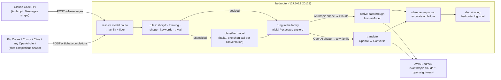

# Bedrouter

A local proxy that puts a **cost-aware model router** in front of **AWS Bedrock** for AI coding tools. Claude Code, Pi, Codex, Cursor, Cline and any other OpenAI- or Anthropic-compatible client keep speaking the API they already speak; only the base URL changes. Bedrouter reads each request, decides which model in the ladder deserves it, sends it to Bedrock, and writes one JSON line per request saying what it decided, why, and what it cost against what the client asked for.

The client does not have to choose a model. It can send `model: auto` and let the router own the decision; or it can name a model, which the router treats as a floor it will not go below unless the request is judged trivial.



## Contents

- [What it does](#what-it-does)
- [Quick start](#quick-start)
- [Credentials: one mechanism, two machines](#credentials-one-mechanism-two-machines)
- [Pointing clients at it](#pointing-clients-at-it)
- [How routing works](#how-routing-works)
- [Configuration](#configuration)
- [Decision log](#decision-log)
- [Savings report](#savings-report)
- [Development](#development)
- [Design notes](#design-notes)

## What it does

1. **One endpoint, two API shapes.** `POST /v1/messages` accepts the Anthropic Messages API (what Claude Code and Pi's `anthropic-messages` provider send) and forwards it to Bedrock `InvokeModel` byte-for-byte, so tool use, extended thinking, `cache_control` and `anthropic-beta` headers all survive. `POST /v1/chat/completions` accepts OpenAI chat completions and translates them to Bedrock `Converse`, which works for every model family. Both stream.
2. **A ladder per family with prices.** `bedrouter.json` lists each family's rungs cheapest-first (`haiku → sonnet → opus`, `gpt-oss-20b → gpt-oss-120b`) with USD per million tokens, plus aliases for the names clients send by default.
3. **Class-based routing.** Each conversation is classified `trivial`, `execute` or `explore` and starts on the rung configured for that class. Cheap rules run first (thinking flag, prompt shape, keyword lists); when they are undecided, a small **classifier model** reads the request and decides. The classification is **sticky per conversation** so Bedrock prompt caching keeps working, moves **up on intent** when the user explicitly asks for design or investigation, and **escalates** one rung when a response visibly fails (`max_tokens`, empty output, malformed tool JSON, throttling, a client retry).
4. **A decision log and a savings report.** Every request appends one JSON line: requested vs routed model, class, deciding signal, tokens, latency, cost, and the counterfactual cost at the requested model. `npm run report` turns the log into a savings breakdown.

It never leaves the family the client chose, never silently falls back to a model that is not in the config, and never sends a request anywhere but Bedrock.

## Quick start

Requires Node 20+, the AWS CLI (for `aws sso login`), and an AWS principal allowed to call Bedrock.

```sh
git clone <this repo> && cd bedrouter
npm install                   # also builds dist/ (the `bedrouter` binary)
cp .env.example .env          # set AWS_PROFILE for this machine (see Credentials)
aws sso login --profile bedrouter
npm run doctor                # which credentials resolved, loaded ladder
npm run doctor -- --probe     # 1-token call per rung: which models THIS account can actually invoke
npm start                     # http://127.0.0.1:20129   (npm run start:debug prints every decision)
```

Installed as a dependency (`npm install github:bmelton/bedrouter`) the same things are `bedrouter serve|doctor|report|smoke`, run from a directory that holds `.env` and `bedrouter.json`. Pi users: the [pi-bedrouter](https://github.com/bmelton/pi-bedrouter) extension installs, starts and configures all of this from inside Pi.

`npm start` runs the credential check first and refuses to start when nothing resolves, printing the command that fixes it. The committed `bedrouter.example.json` is used until you copy it to `bedrouter.json` (gitignored) to match your account: the probe tells you which rungs to swap. Frontier models are not entitled on every account; a personal account may have Haiku 4.5 and Opus 4.7/4.8 but not Opus 5, for instance.

Then point a client at it (below) and watch decisions arrive. `npm run start:debug` prints them as they happen:

```
→ 13:02:11 /v1/chat/completions  model=auto-oss  1 msg  9 tools  ~4.2k tok  stream
  routed  gpt-oss-20b (auto) ≠> gpt-oss-120b  [explore · classifier:explore]  conv=c01b9ab5927e80b5  classifier: "open-ended design question" 612 ms $0.00002
          openai.gpt-oss-120b-1:0
  ← end_turn  in 4.3k  out 512  6210 ms  $0.00095 (asked-for model: $0.00040)
```

The same information, one JSON object per request, is in `bedrouter.log.jsonl`:

```sh
tail -f bedrouter.log.jsonl | jq -c '{class, classReason, requested: .requestedModel, routed: .routedModel, cost: .costUsd, ifRequested: .requestedCostUsd, escalated}'
```

### Environment

| Variable | Default | Meaning |
| --- | --- | --- |
| `PORT` | `20129` | Listen port (always binds `127.0.0.1`) |
| `AWS_REGION` | `us-east-1` | Bedrock region |
| `AWS_PROFILE`, `AWS_ACCESS_KEY_ID` / `AWS_SECRET_ACCESS_KEY` / `AWS_SESSION_TOKEN`, `AWS_BEARER_TOKEN_BEDROCK` | | Standard AWS SDK credential chain (any one source). The SDK only reads the standard names; `AWS_ACCESS_KEY` / `AWS_SECRET_KEY` are ignored |
| `BEDROUTER_CONFIG` | `./bedrouter.json` | Model map; falls back to `bedrouter.example.json` when the default path is missing |
| `BEDROUTER_LOG` | `./bedrouter.log.jsonl` | Decision log path |
| `BEDROUTER_API_KEY` | unset | When set, requests must carry it in `x-api-key` or `Authorization: Bearer`; when unset any key is accepted (localhost tool) |
| `BEDROUTER_ENV` | `./.env` | Env file loaded at startup; values already in the environment win |
| `BEDROUTER_SKIP_PREFLIGHT` | unset | Start even when the credential check fails |
| `BEDROUTER_DEBUG` | unset | `1` prints a readable trace of every request to stdout (same as `npm run start:debug` / `--debug`): arrival, routing decision with the deciding signal and classifier note, and the result with tokens, latency and cost |

The IAM principal needs `bedrock:InvokeModel` and `bedrock:InvokeModelWithResponseStream` on the models and inference profiles in the config (the classifier model included). `bedrock:ListFoundationModels`, `GetFoundationModel`, `ListInferenceProfiles`, `GetInferenceProfile`, `GetFoundationModelAvailability` are useful for the probe but not required.

## Credentials: one mechanism, two machines

Bedrouter uses the AWS SDK default credential chain and nothing else. The only per-machine setting is `AWS_PROFILE` in the gitignored `.env`. A personal account through IAM Identity Center and a corporate account through its SSO are the same mechanism, so the workflow is identical on both: `aws sso login --profile <name>` once per session, then `npm start`.

Personal account via IAM Identity Center (`~/.aws/config`):

```ini
[sso-session sureisfun]
sso_start_url = https://d-xxxxxxxxxx.awsapps.com/start
sso_region = us-east-1
sso_registration_scopes = sso:account:access

[profile bedrouter]
sso_session = sureisfun
sso_account_id = 123456789012
sso_role_name = BedrockInvoke
region = us-east-1
```

Corporate SSO: run `aws configure sso`, accept whatever profile name it generates (the profile name is arbitrary, `sso_role_name` is what matters) and put that name in `.env` as `AWS_PROFILE`.

Setting up the personal side from scratch (console, about ten minutes): enable IAM Identity Center (organization instance, single region), add a user, create a permission set whose inline policy allows `bedrock:InvokeModel` and `bedrock:InvokeModelWithResponseStream` (plus the read-only `bedrock:List*`/`Get*` above), and assign user + permission set to the account. Then submit Anthropic's one-time use-case form from the Bedrock model catalog and make one call to a Claude model in the console playground as an admin, which performs the Marketplace auto-subscription a restricted permission set cannot. Serverless models no longer need per-model "model access" requests, but entitlement to frontier models varies by account; `npm run doctor -- --probe` shows what you have.

When a session expires, `npm start` and `npm run doctor` say so and print the `aws sso login` command to run.

## Pointing clients at it

Every client needs a base URL and a model name. The model name is either one of the config's aliases or `auto`.

**`auto`** (`"auto": "auto:anthropic"` and `"auto-oss": "auto:openai"` in the example) means "this family, you decide": no floor, no pinning, the router picks the rung. **A named model** means "at least this": the router may go up (explore, escalation) but only goes below it for a `trivial` request, and explicitly requesting the cheapest rung pins the request there (that is how Claude Code's haiku subagents and title generation stay cheap). Set `routing.honorClientModel: false` to make every model name behave like `auto`.

### Claude Code

```sh
export ANTHROPIC_BASE_URL=http://127.0.0.1:20129
export ANTHROPIC_API_KEY=anything          # or the value of BEDROUTER_API_KEY
claude --model auto                        # or claude-sonnet-5, claude-opus-5, ...
```

The `aliases` block maps the names Claude Code sends by default (`claude-opus-5`, `claude-sonnet-5`, `claude-haiku-4-5-20251001`, ...) onto rungs; a trailing `[1m]` is stripped.

### Pi

Pi's custom providers live in `~/.pi/agent/models.json`. Two options: the Anthropic dialect for the Claude ladder, or the OpenAI dialect for either ladder (the only way to reach gpt-oss from Pi). A provider needs `baseUrl`, `api`, a non-empty `apiKey` and a `models` list; every `cost` object must have all four fields.

```json
{
  "providers": {
    "bedrouter": {
      "baseUrl": "http://127.0.0.1:20129",
      "api": "anthropic-messages",
      "apiKey": "x",
      "models": [
        { "id": "auto",            "name": "Auto (bedrouter routes it)", "reasoning": true, "input": ["text", "image"], "contextWindow": 200000, "maxTokens": 64000,
          "cost": { "input": 2.2, "output": 11, "cacheRead": 0.22, "cacheWrite": 2.75 } },
        { "id": "claude-sonnet-5", "name": "Sonnet (bedrouter)",         "reasoning": true, "input": ["text", "image"], "contextWindow": 200000, "maxTokens": 64000,
          "cost": { "input": 2.2, "output": 11, "cacheRead": 0.22, "cacheWrite": 2.75 } }
      ]
    },
    "bedrouter-oss": {
      "baseUrl": "http://127.0.0.1:20129/v1",
      "api": "openai-completions",
      "apiKey": "x",
      "models": [
        { "id": "auto-oss",     "name": "Auto gpt-oss (bedrouter)", "reasoning": true, "input": ["text"], "contextWindow": 128000, "maxTokens": 32000,
          "cost": { "input": 0.15, "output": 0.6, "cacheRead": 0.015, "cacheWrite": 0.1875 } },
        { "id": "gpt-oss-120b", "name": "gpt-oss 120b (bedrouter)",  "reasoning": true, "input": ["text"], "contextWindow": 128000, "maxTokens": 32000,
          "cost": { "input": 0.15, "output": 0.6, "cacheRead": 0.015, "cacheWrite": 0.1875 } }
      ]
    }
  }
}
```

Note the `/v1` suffix for the OpenAI dialect (OpenAI clients append `/chat/completions`; Anthropic clients append `/v1/messages`). If your `settings.json` has an `enabledModels` allowlist, add `bedrouter/auto` etc. to it or the provider will appear not to exist. Then `pi --provider bedrouter --model auto`. Pi's cost display is what Pi *thinks* it is talking to; the decision log has what was actually charged. A separate `pi-bedrouter` package will register this provider for you; the JSON above is the manual route.

### OpenAI-compatible tools (Codex, Cursor, Cline, Continue, ...)

Base URL `http://127.0.0.1:20129/v1`, API key anything (or `BEDROUTER_API_KEY`), model `auto-oss`, `gpt-oss-120b`, `sonnet`, ... (`GET /v1/models` lists them). Tool calls, `tool_choice`, data-URL images, `stop`, `temperature`, `top_p`, `max_tokens` are translated; `n`, `logprobs` and http image URLs are not. gpt-oss reasons before it answers and the reasoning is streamed as `reasoning_content`; it also counts against `max_tokens`.

### Endpoints

| Route | Shape | Path to Bedrock |
| --- | --- | --- |
| `POST /v1/messages` | Anthropic Messages API, streaming and non-streaming | Native passthrough: `InvokeModel` / `InvokeModelWithResponseStream`. Anthropic family only (a 400 says so) |
| `POST /v1/chat/completions` | OpenAI chat completions, streaming and non-streaming | Translated to `Converse` / `ConverseStream`; any family |
| `GET /v1/models` | OpenAI model list | The configured aliases and rungs, each with a `bedrouter: { family, rung, auto, inputPerM, outputPerM }` block |
| `GET /v1/conversations/:key` | | Running totals for one conversation (requests, cost, requested cost, classifier cost, tokens, escalations, current class/rung); `GET /v1/conversations` lists the last 50 |
| `GET /health` | | `{ ok, region, pid, version, routing, classifier, uptimeS }` |

Every routed response also carries the decision in headers, so clients can show it live without reading the log: `x-bedrouter-model` (routed rung), `x-bedrouter-requested`, `x-bedrouter-bedrock-id`, `x-bedrouter-class`, `x-bedrouter-reason`, `x-bedrouter-conversation` (key for the endpoint above) and `x-bedrouter-classifier` (the classifier's note, when it ran). [pi-bedrouter](https://github.com/bmelton/pi-bedrouter) uses these for its footer.

A request naming a model that is not in the config gets a 404 listing the valid names. There is never a silent fallback.

## How routing works

The router's job is to send each request to the cheapest model that should complete it reliably. It never leaves the family the client asked for. It is rules plus a small in-memory map plus, optionally, one cheap model call per conversation.

### Classes

| Class | Meant for | Example starting rung |
| --- | --- | --- |
| `trivial` | The opening ask of a conversation when it is short, has no tools and little context: titles, one-line questions, summaries | `haiku` (optional; a family without a `trivial` rung never uses the class) |
| `execute` | Well-defined implementation against a known spec; ordinary coding work | `sonnet` / `gpt-oss-20b` |
| `explore` | Architecture, design, investigation, debugging an unknown cause, open-ended reasoning | `opus` / `gpt-oss-120b` |

`routing.classes.<family>` maps each class to the rung it starts on. A conversation can climb above its starting rung; it never goes below it.

### Signals, in order

Evaluated cheapest first on the request that classifies a conversation. The first decisive one wins.

1. **Client model.** A named model is a floor (`honorClientModel`, default `true`); `auto` has no floor. A request *below* the family's `execute` rung (Claude Code sends `haiku` for subagents and titles) is the client's explicit cheap choice: it runs as `execute` on that rung, is never upgraded, and is not tracked.
2. **Thinking.** An Anthropic `thinking` block, or OpenAI `reasoning_effort` of `high` or above, is `explore`.
3. **Prompt shape.** Estimated input tokens at or above `shape.exploreInputTokens`, or at least `shape.exploreTools` tools, is `explore`. A conversation already `shape.executeTurns` messages deep whose last user text is at most `shape.executeLastUserChars` characters (a tool-driven agentic loop) is `execute`. The token estimate is body length divided by four.
4. **Explore keywords.** Word-boundary, case-insensitive matches on the last user message (Claude Code's `<system-reminder>` blocks stripped) against `routing.keywords.explore`.
5. **Trivial shape.** Only when the family has a `trivial` rung: at most one non-system message, no tools, a last user message of at most `shape.trivialMaxChars` characters and at most `shape.trivialMaxInputTokens` estimated input tokens. This is the one verdict that may go *below* the client's model (`trivialBelowFloor`, default `true`).
6. **Execute keywords.** `routing.keywords.execute`, same matching.
7. **Default.** `execute`.

Signals 2 and 3 are considered decisive. Signals 4 to 7 are "soft", and this is where the classifier model comes in.

### The classifier model

When `routing.classifier.enabled` is set, a small model (the example uses `haiku`; any rung in any family works, it is called through Converse) is asked to classify the request whenever the rules landed on `default` (`mode: "fallback"`), or whenever they landed on any soft signal (`mode: "always"`, which lets the model overrule the keyword lists). It sees the turn count, tool count, estimated context size, an excerpt of the system prompt and the latest user message (up to `maxChars`), and answers one line: `CLASS: reason`. Its verdict replaces the class and starting rung for the conversation; its reason, latency and cost go into the log (`classReason: "classifier:explore"`, `classifierNote`, `classifierMs`, `classifierCostUsd`).

Because classification happens once per conversation (and on explicit upgrade turns), the overhead is one call of a few hundred input tokens and about a dozen output tokens per session, typically well under a second, not per request. If the call fails, times out (`timeoutMs`) or answers something unparseable, the rules' decision stands and the log says why. The report counts classifier spend against savings.

### Stickiness

The first request in a conversation classifies; later requests reuse the same rung. The conversation key is a hash of `metadata.user_id` (or OpenAI `user`) plus the system prompt plus the first user message, so it survives every turn of a session and changes when the client compacts context. This matters for cost: Bedrock prompt caching is per model, so switching models mid-session throws away the cached system prompt and tool definitions and can cost more than the cheaper rung saves. The map is in memory, capped at `routing.maxConversations` entries (least recently used dropped), and not persisted across restarts.

Two things can move a sticky conversation up, never down:

- **Upgrade on intent** (`upgradeOnIntent`, default `true`): a new user turn (the user typing, not a tool result coming back) that carries an explicit explore signal, an explore keyword or thinking switched on, moves the conversation to the explore rung. Shape signals do not trigger this, so a long execute session is not silently upgraded as its context grows. Logged as `classReason: "upgrade:keyword:explore"` or `upgrade:thinking`.
- **Escalation** (below).

A `trivial` conversation is the exception to stickiness: as long as it has not been escalated it is re-classified on every request, because a trivial exchange has nothing worth caching and a conversation that starts with "hi" should not be pinned to the cheapest model once real work begins. The first request that is no longer trivial classifies normally and becomes sticky.

### Escalation

After each response the router checks for observable failure and, if it finds one, moves the conversation up one rung (never past the family's strongest, never back down):

- `stop_reason` / `stopReason` of `max_tokens`
- an empty response (zero output tokens)
- streamed tool-call arguments that do not assemble into valid JSON
- a Bedrock throttling, overload, or model error (HTTP 429 or 5xx); client faults such as 400/404 do not count
- the client re-sending an identical message list within `routing.retryWindowMs` (default 60 s), which is what a client does when it gave up on the last answer

The line for the request where the trigger was observed carries `escalated: true` and the reason; the next line in the same conversation shows the new `routedModel`. Requests the client aborted are ignored.

### Bypass

- Header `x-bedrouter-class: trivial`, `execute` or `explore` forces the class for that one request (the client's model is still a floor for `execute`/`explore`) without touching the conversation's sticky rung.
- Header `x-bedrouter-class: off` forwards to the requested model exactly as if routing were disabled.
- `routing.enabled: false`, or no `routing` block at all, turns the router off globally. A family without a `classes` entry is forwarded as requested too.

### What to expect under a coding agent

Coding agents attach their tools and a multi-thousand-token system prompt to every request, so under Claude Code or Pi nothing is ever `trivial`; you will see `execute` and `explore`, decided by keywords on the opening message or by the classifier, sticky for the session, moving up on an explicit "why / design / compare" turn or on a failure. Standalone chat clients and one-shot API calls are where `trivial` earns its keep. Under `honorClientModel: true`, asking for the strongest model gets it; ask for the family's `execute` rung or `auto` to see routing in both directions.

## Configuration

`bedrouter.json` (copy `bedrouter.example.json`; the example is used automatically when no config exists):

```json
{
  "families": {
    "anthropic": [
      { "alias": "haiku",  "bedrockId": "us.anthropic.claude-haiku-4-5-20251001-v1:0", "inputPerM": 1.1, "outputPerM": 5.5 },
      { "alias": "sonnet", "bedrockId": "us.anthropic.claude-sonnet-5",                "inputPerM": 2.2, "outputPerM": 11 },
      { "alias": "opus",   "bedrockId": "us.anthropic.claude-opus-5",                  "inputPerM": 5.5, "outputPerM": 27.5 }
    ],
    "openai": [
      { "alias": "gpt-oss-20b",  "bedrockId": "openai.gpt-oss-20b-1:0",  "inputPerM": 0.07, "outputPerM": 0.2 },
      { "alias": "gpt-oss-120b", "bedrockId": "openai.gpt-oss-120b-1:0", "inputPerM": 0.15, "outputPerM": 0.6 }
    ]
  },
  "aliases": { "auto": "auto:anthropic", "auto-oss": "auto:openai", "claude-sonnet-5": "sonnet", "gpt-oss": "gpt-oss-120b" },
  "routing": {
    "enabled": true,
    "classifier": { "enabled": true, "model": "haiku" },
    "classes": {
      "anthropic": { "trivial": "haiku", "execute": "sonnet", "explore": "opus" },
      "openai":    { "execute": "gpt-oss-20b", "explore": "gpt-oss-120b" }
    },
    "keywords": { "explore": ["design", "why", "investigate"], "execute": ["implement", "fix", "rename"] }
  }
}
```

- `families.<family>` is an ordered ladder, cheapest first. The family decides the Bedrock path (`anthropic` = native passthrough for Anthropic-shape requests; everything goes through Converse for OpenAI-shape requests).
- `bedrockId` is what Bedrock receives. Prefer the `us.` cross-region inference profile IDs where they exist; several Claude models reject the bare foundation-model ID with on-demand throughput.
- `inputPerM` / `outputPerM` are USD per million tokens and feed the cost estimate. Cache reads are charged at 0.1x and cache writes at 1.25x of the input rate. Prices are static; there is no live lookup.
- `aliases` map client model names onto rung aliases, exact match. The special target `auto:<family>` creates an auto alias for that family.
- `routing` configures the router. Leave it out to keep exact-model forwarding.

### Routing keys

| Key | Default | Meaning |
| --- | --- | --- |
| `routing.enabled` | `false` (the example ships `true`) | Master switch |
| `routing.honorClientModel` | `true` | A named model is a floor for `execute` and `explore`; `false` makes every name behave like `auto` |
| `routing.trivialBelowFloor` | `true` | A `trivial` verdict may pick a rung below the requested model |
| `routing.upgradeOnIntent` | `true` | A later user turn with an explore keyword or thinking on moves the conversation up |
| `routing.classifier.enabled` | `false` (the example ships `true`) | Consult a model when the rules are undecided |
| `routing.classifier.model` | | Rung alias of the classifier model (any family; called via Converse) |
| `routing.classifier.mode` | `fallback` | `fallback`: only when the rules hit `default`. `always`: also when they hit a keyword or trivial-shape signal |
| `routing.classifier.maxChars` | `4000` | Longest user-message excerpt shown to the classifier |
| `routing.classifier.timeoutMs` | `4000` | Give up on the classifier and keep the rules' decision after this long |
| `routing.maxConversations` | `1000` | Sticky map size, LRU |
| `routing.retryWindowMs` | `60000` | Window for the identical-prompt retry signal |
| `routing.classes.<family>.<class>` | | Starting rung alias per class; must be a rung of that family; `trivial` is optional |
| `routing.shape.exploreInputTokens` | `60000` | Estimated input tokens at which a request is `explore` |
| `routing.shape.exploreTools` | `40` | Tool count at which a request is `explore` |
| `routing.shape.executeTurns` | `8` | Message count from which a short last user message means `execute` |
| `routing.shape.executeLastUserChars` | `200` | "Short" for the rule above |
| `routing.shape.trivialMaxChars` | `300` | Longest last user message that can be `trivial` |
| `routing.shape.trivialMaxInputTokens` | `1500` | Largest estimated request (system prompt included) that can be `trivial` |
| `routing.keywords.explore` / `.execute` | `[]` | Word lists for the keyword signals |

### Model IDs and prices in the example

Verified against the AWS model cards (September 2026) and against the live account: Bedrock validates the model ID before authorization, so every ID in the example resolves to a real resource ARN (an invalid ID fails with `ValidationException`, a valid one returned `AccessDeniedException` from the test principal). `ListFoundationModels` was not permitted for that principal, so the inventory was checked this way rather than listed.

Prices for the Claude rows are Anthropic's published Bedrock rates with the 10% premium AWS charges for regional (`us.`) profiles over `global.` ones. Switch the IDs to `global.` and drop the premium if data residency does not matter. The gpt-oss rows are the US East on-demand rates from the Bedrock pricing page. Update the numbers when AWS changes them.

### Which Bedrock path was verified

Bedrock offers two ways to reach Claude natively: `InvokeModel` on `bedrock-runtime` with the Anthropic body (`anthropic_version: "bedrock-2023-05-31"`, betas in `anthropic_beta`), and the newer Messages-API endpoint at `https://bedrock-mantle.<region>.api.aws/anthropic/v1/messages` (SigV4 service `bedrock-mantle`, bearer tokens via `x-api-key`). Bedrouter uses `InvokeModel`, because the AWS SDK supports it directly and AWS documents that Opus 4.7+ requests through it are served by the same infrastructure as the Messages endpoint. The mantle endpoint has no SDK client and needs hand-rolled SigV4, so it was left out. The passthrough has since been exercised live (streaming `/v1/messages` against `us.anthropic.claude-haiku-4-5` from a personal account with the Identity Center setup described above); the OpenAI path against `openai.gpt-oss-20b` via `ConverseStream` likewise.

GPT-5.x models exist on Bedrock only behind the mantle `openai/v1/responses` path, so they are not reachable here; the OpenAI family is `gpt-oss-20b` / `gpt-oss-120b` via Converse.

## Decision log

One JSON object per line in `BEDROUTER_LOG`:

```json
{"ts":"2026-09-10T02:51:53.055Z","endpoint":"/v1/messages","clientModel":"claude-sonnet-5","bedrockId":"us.anthropic.claude-opus-5","family":"anthropic","stream":true,"inputTokens":1830,"outputTokens":212,"cacheReadTokens":1500,"cacheWriteTokens":0,"latencyMs":2410,"costUsd":0.0077,"requestedCostUsd":0.0031,"stopReason":"end_turn","error":null,"class":"explore","classReason":"sticky","conversationKey":"c01b9ab5927e80b5","requestedModel":"sonnet","routedModel":"opus","sticky":true,"escalated":false,"escalationReason":null,"classifierNote":null,"classifierMs":null,"classifierCostUsd":null}
```

| Field | Meaning |
| --- | --- |
| `ts` | Request start, ISO 8601 |
| `endpoint` | `/v1/messages` or `/v1/chat/completions` |
| `clientModel` / `bedrockId` / `family` | What the client asked for and what it resolved to (`null` when resolution failed) |
| `stream` | Streaming flag from the request |
| `inputTokens`, `outputTokens`, `cacheReadTokens`, `cacheWriteTokens` | From Bedrock usage (`null` when the request never reached the model) |
| `latencyMs` | Wall clock from request start to response end |
| `costUsd` | Estimate from the price table for the model actually called |
| `requestedCostUsd` | The same token counts priced at the model the client asked for. `requestedCostUsd - costUsd` is what routing saved on that request (negative when it went up a rung). An estimate: another model would have produced a different number of output tokens |
| `stopReason` | Bedrock/Anthropic stop reason |
| `error` | Error message, or `null` |
| `class` | `trivial`, `execute`, `explore`, or `null` when the router did not run (disabled, `x-bedrouter-class: off`, no `classes` for the family) |
| `classReason` | Which signal decided: `sticky`, `classifier:<class>`, `upgrade:keyword:explore`, `upgrade:thinking`, `client-model:pinned`, `thinking`, `shape:long-context`, `shape:many-tools`, `shape:agentic-loop`, `keyword:explore`, `shape:trivial`, `keyword:execute`, `default`, `header:<value>`, `disabled`, `no-classes` |
| `conversationKey` | 16 hex chars identifying the conversation for stickiness, or `null` when not tracked |
| `requestedModel` / `routedModel` | Rung aliases: what the client's model resolved to and what was actually called (`bedrockId` is the routed ID) |
| `sticky` | `true` when the rung came from an earlier request in the same conversation |
| `escalated` | `true` when this request moved its conversation up one rung (see below) |
| `classifierNote` / `classifierMs` / `classifierCostUsd` | Present when the classifier model was consulted: its one-line reason (or the error that made the rules' decision stand), its latency, and its cost |
| `escalationReason` | The trigger that fired, even when the conversation was already at the strongest rung and nothing moved: `max_tokens`, `empty`, `malformed-tool-json`, `bedrock:<status>`, `retry` |

## Savings report

`npm run report` reads the decision log and prints what routing cost against what the same usage would have cost on the model each client asked for (for `auto`, the family's `execute` rung), broken down by class, by route (`requested -> routed`) and by the signal that decided, plus escalation triggers and classifier overhead. `-- --since <ISO time>` limits it to a window (a demo session), `-- --log <path>` picks another file, `-- --json` emits the same numbers as JSON.

```
bedrouter report  ./bedrouter.log.jsonl
  requests 41 (40 reached a model, 1 errors), conversations 6
  tokens   in 412300  out 18220  cache-read 301000
  cost     $1.2140 actual vs $2.0410 if every request had run on the model the client asked for
  classifier 6 calls, $0.0031, avg 640 ms (counted against savings)
  saved    $0.8239 (40.4%)

By class
                                   reqs    in tok  out tok       cost  if requested      saved  esc
  execute                            31    380000    15000    $1.0100       $1.9000    $0.8900    1
  explore                             3     30000     3000    $0.2000       $0.1300   $-0.0700    0
  trivial                             6      2300      220    $0.0040       $0.0110    $0.0070    0
```

"If requested" is the counterfactual per request; explore rows are usually negative (the router went up), execute and trivial rows positive. It is an estimate: another model would have produced a different number of output tokens.

### Tuning the ladder from the log

Every line records what was asked for, what was chosen, why, and how it went, so the ladder can be adjusted from data instead of guesses. Some questions the log answers with `jq`:

```sh
# Which signal decides most first requests, and how do they turn out?
jq -r 'select(.sticky==false and .class!=null) | [.classReason, .class, .routedModel, .stopReason] | @tsv' bedrouter.log.jsonl | sort | uniq -c | sort -rn

# What triggers escalation, and on which rung? Frequent max_tokens on sonnet suggests raising the execute floor or max_tokens.
jq -r 'select(.escalationReason!=null) | [.escalationReason, .routedModel, .escalated] | @tsv' bedrouter.log.jsonl | sort | uniq -c

# Cost per class and rung.
jq -r 'select(.costUsd!=null) | [.class, .routedModel] | @tsv' bedrouter.log.jsonl | sort | uniq -c
jq -s 'group_by(.routedModel) | map({model: .[0].routedModel, usd: (map(.costUsd // 0) | add)})' bedrouter.log.jsonl

# Requests that went up because of a keyword: read the keyword lists against these to prune false positives.
jq -c 'select(.classReason=="keyword:explore") | {conversationKey, requestedModel, routedModel, costUsd}' bedrouter.log.jsonl
```

If `explore` conversations often finish with short, uneventful responses, the explore keyword list is too broad; if `execute` conversations escalate often, the execute rung is too weak for that workload or the keyword list misses the work that needs the stronger model.

## Development

```sh
npm test               # node:test unit tests: translators, streaming assembly, model map, cost, router, classifier, server
npm run typecheck
npm run doctor         # credential source, expiry, loaded config; add -- --probe to test-invoke every rung
npm run smoke          # one small streaming request per endpoint against real Bedrock; skips when no credentials
npm run report         # savings report over the decision log
```

Layout: `src/cli.ts` (the `bedrouter` binary: serve/doctor/report/smoke), `src/env.ts` (loads `.env`, imported first), `src/preflight.ts` (credential check, friendly SSO errors), `src/config.ts` (model map, aliases, cost), `src/router.ts` (rules, sticky map, upgrades, escalation; pure, no I/O), `src/classifier.ts` (classifier prompt, parsing, the one Converse call), `src/translate.ts` (OpenAI ↔ Converse, pure), `src/server.ts` (routes, Bedrock calls, decision log, conversation tallies), `src/doctor.ts` / `src/report.ts` / `src/smoke.ts`. `npm run build` emits `dist/` (gitignored; built by `prepare` on install). `createServer(cfg, client)` takes a fake Bedrock client, which is how the server tests run without credentials. Single runtime dependency (`@aws-sdk/client-bedrock-runtime`), stdlib `http`, no framework; deliberate ceilings are marked `// ponytail:` in source.

Pi integration is deliberately not in this repo; it lives in the separate `pi-bedrouter` package, which expects a running bedrouter.

## Design notes

**Why rules first and a model second.** Most opening messages under a coding agent are decidable from the request itself for free: thinking is on, or the ask says "design" or "fix". The classifier costs latency and money on every conversation it touches, so it is asked only where it adds information, and its verdict is logged with its reason so the keyword lists can be tuned from what it decides.

**Why sticky.** Bedrock prompt caching is per model. A coding agent's cached system prompt and tool schemas are usually the largest part of every request; switching models mid-conversation to save on output tokens would re-pay the whole prefix.

**Why never down.** Every downward move is a guess that the conversation got easier; an upward move is a response to evidence (a failure, an explicit ask). The asymmetry keeps the router's mistakes cheap and visible.

**Why `auto` and a floor both exist.** A demo or a shared tool wants the router to own the decision. A developer who typed `--model opus` has made a decision and should get it; the floor keeps that promise while still letting trivial asks go cheap.

